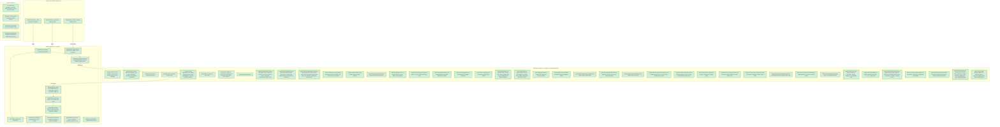

# RackSense — System Graph

_Generated: 2026-10-29T02:45:00Z (Master Integration, Visual Management & Full-Stack Complete)_

### 1. Full-Stack Module Graph

```mermaid
graph TD
    classDef done fill:#d4edda,stroke:#28a745,stroke-width:2px;

    subgraph Hardware["hardware/ (Firmware Shipped in Kit)"]
        H_ENV["hardware/node_env_esp32 (ESP32 Dev Module)"]:::done
        H_VIB["hardware/node_vib_esp32s3 (ESP32-S3 #2)"]:::done
        H_AUTH["hardware/auth_console_esp32s3 (ESP32-S3 #1)"]:::done
    end

    subgraph Backend["backend/ (Phases A–F Complete)"]
        B_INGEST["backend/ingest (validator, normaliser, subscriber)"]:::done
        B_DB["backend/db (SQLite WAL, connection)"]:::done
        B_REPOS["backend/repos (nodes, telemetry, topology, users, audit, analysis, baselines, proposals, readers)"]:::done
        B_SCOPE["backend/repos/scope.py (apply_scope single choke point)"]:::done
        B_AUDIT["backend/services/audit.py (SHA-256 hash chain, verify)"]:::done
        B_ANALYSIS["backend/services (forecast, changepoint, attribution, power, scheduler)"]:::done
        B_APPROVAL["backend/services/approval.py (RFID nonce, HMAC, atomic consume)"]:::done
        B_AI["backend/services/ai (RAG, client, summarizer, explainer, proposer, chat)"]:::done
        B_BROADCAST["backend/services/broadcaster.py (RealtimeBroadcaster, 500ms batching, backpressure)"]:::done
        B_LIMIT["backend/core/ratelimit.py (sliding window limiter)"]:::done
        B_API["backend/api (auth, meta, ws, topology, telemetry, racks, audit, analysis, proposals, reader, ai)"]:::done
    end

    subgraph Frontend["frontend/src (Phases 1–6 Complete + Visual Management)"]
        F_TOKENS["design/tokens.css (CSS Variables, .hatch-foreign, .pulse-escalation, .hatch-estimated)"]:::done
        F_PRIMITIVES["design/primitives (Card, Value, StatusBadge, Chip, KpiTile, DataTable, DetailPanel, EmptyState, ErrorState)"]:::done
        F_CONTRACT["api/contract.ts (Closed Enums & Payloads)"]:::done
        F_CLIENT["api/client.ts (Fetch Wrapper & Drift Check)"]:::done
        F_WS["api/ws.ts (Single WebSocket Hook, 500ms Batching Buffer, Stable onChangepoint, Reconnect Backoff, Heartbeat)"]:::done
        F_AUTH["app/authStore.ts (Zustand Auth Store)"]:::done
        F_SHELL["app/Shell.tsx (56px Bar, Live Indicator, Changepoint Toast with Ref Cleanup, Nav, Content)"]:::done
        F_LOGIN["features/auth/LoginPage.tsx"]:::done
        F_HALL["features/hall/RackHallCanvas.tsx (3D WebGL Data Center Hall, Demand Frameloop, Camera Presets, Overhead Infrastructure, CRAC Units)"]:::done
        F_AMBIENT["features/hall/AmbientRack3D.tsx (Enterprise Ambient Server Rack, Plinth, Canopy, Rails, Blade Hardware, Unmonitored Inventory)"]:::done
        F_VMV["features/hall/VisualManagementView.tsx (Industrial DCIM Command Center Layout, TwinThings/IOC Inspired, Full-Page Total View with Floating Side Metrics Dock)"]:::done
        F_TIMELINE["features/hall/ForecastTimelineBar.tsx (Interactive Forecast Scrubber, Live vs ETS Horizon, Auto-Play)"]:::done
        F_OVERVIEW["features/hall/OverviewPanel.tsx (Racks, Nodes, Sensors, Tenants)"]:::done
        F_DONUT["features/hall/ClassificationDonut.tsx (Sensor Distribution Ring Chart)"]:::done
        F_BARS["features/hall/StatisticsBars.tsx (Rack Capacity, Thermal Margin, Power Margin)"]:::done
        F_GAUGES["features/hall/ConsumptionGauges.tsx (PUE, IT Power, Total Power, Empty State)"]:::done
        F_STATUS["features/hall/StatusDistribution.tsx (OK/WARN/CRIT/OFFLINE Stacked Bar & Filter)"]:::done
        F_TRENDS["features/hall/TrendSparkline.tsx (AreaChart Worst-Margin Sparkline)"]:::done
        F_TABS["features/hall/CategoryTabs.tsx (Telemetry Category Filter Chips)"]:::done
        F_RACK3D["features/hall/Rack3D.tsx (Chassis Frame, EIA-310 Rails, Plinth, Canopy, Side Panels, Standby Server Blades, Billboard)"]:::done
        F_SLOT3D["features/hall/Slot3D.tsx (Brushed Steel Chassis, Pull Handles, Hot-Swap Drive Caddies, Status Light Bar, LEDs, Tooltip)"]:::done
        F_HATCH["features/hall/hatchTexture.ts (Canvas 45° Repeating Diagonal Texture)"]:::done
        F_RACK_GRID["features/datacenter/RackGrid.tsx (2D Physical Elevation Fallback, Hatch)"]:::done
        F_RACK_SUMMARY["features/datacenter/RackSummaryCard.tsx (Worst Margin, Nodes Ratio)"]:::done
        F_SLOT_DETAIL["features/topology/SlotDetailPanel.tsx (Sparklines, Honest Provenance, AiPanel Mounted)"]:::done
        F_ISOLATION["features/datacenter/IsolationSplitView.tsx (Dual-Token Live Proof)"]:::done
        F_DC["features/datacenter/DataCenterDashboard.tsx (Visual Management View, Live 3D Hall, Keyboard Rail, Audits)"]:::done
        F_TENANT["features/tenant/TenantDashboard.tsx (Visual Management View, Live 3D Hall, Shielded Foreign Slots)"]:::done
        F_FORECAST["features/forecast/ForecastView.tsx (Capacity & Headroom Analysis Page)"]:::done
        F_CONE["features/forecast/ForecastConeChart.tsx (Recharts ComposedChart, Stat Tile, Table View)"]:::done
        F_VIB["features/forecast/VibrationBaselineChart.tsx (x baseline, 2x WARN / 4x CRIT, Table View)"]:::done
        F_ATTR["features/forecast/TenantAttributionChart.tsx (Horizontal Bars, Basis Strings, Table View)"]:::done
        F_POWER["features/forecast/PowerEstimateChart.tsx (Dedicated Chart, 45° Hatch, Formula Tooltip)"]:::done
        F_SPARKLINE["features/forecast/MetricSparkline.tsx (2px Line, Tabular End Label)"]:::done
        F_AI_PANEL["features/ai/AiPanel.tsx (AI Advisory Assistant, Summarize, Explain, Propose, AI · ADVISORY chip)"]:::done
        F_EVIDENCE["features/ai/EvidenceModal.tsx (Verified Evidence Inspection, fc_ / cp_ / audit proof)"]:::done
        F_PROPOSAL_CARD["features/proposals/ProposalCard.tsx (Action Mapping, Emoji Stripping, Revisions Diff, Audited Chat, Server Countdown, TFT Mirror, Terminal States)"]:::done
        F_STEPPER["features/proposals/ProposalStepper.tsx (Proposed -> Discussing -> Approved -> Authorized)"]:::done
        F_APPROVALS["features/proposals/ApprovalsView.tsx (Facility Approvals Queue, Status Filtering, Review Side Panel)"]:::done
        F_AUDIT["features/audit/AuditView.tsx (Cryptographic SHA-256 Chain Verification, Tamper Detection, Single-mount Fetch, Data Grid, Mono Hash Copy, Detail Panel)"]:::done
        F_APP["App.tsx (Role-based Routing, Redirection, Mismatch Banner, Approvals, Audit & Racks Sub-route Navigation)"]:::done
    end

    subgraph Tools["tools/ & Launchers"]
        T_LAUNCH["run_project.py & shared/run_project.py (One-Click Auto-Launcher, Port Auto-Clean)"]:::done
        T_DEMO["tools/demo_check.py (8/8 Pre-flight verification checks)"]:::done
        T_SMOKE["tools/smoke_test.py (8/8 End-to-end integration flow)"]:::done
        T_BACKTEST["tools/synthetic/backtest.py (12-Month Ground-Truth Evaluation on files (1))"]:::done
    end

    H_ENV -->|MQTT| B_INGEST
    H_VIB -->|MQTT| B_INGEST
    H_AUTH -->|HTTP HMAC| B_APPROVAL
    B_INGEST --> B_DB
    B_INGEST --> B_BROADCAST
    B_BROADCAST -->|WebSocket| F_WS
    F_CLIENT -->|HTTP REST| B_API
    B_API --> B_SCOPE
    B_SCOPE --> B_REPOS
    B_REPOS --> B_DB
```
